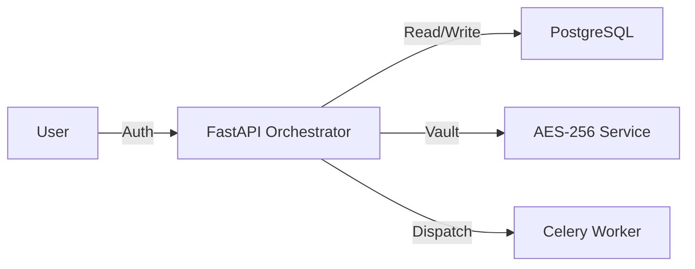
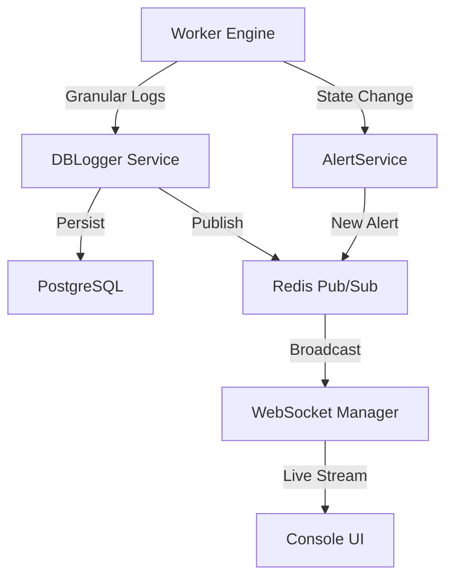

# Backend Architecture

SynqX is built on a high-performance, decoupled architecture that separates the **Control Plane** (Metadata, Scheduling, Orchestration) from the **Data Plane** (Execution, Transformation, Connectivity).

## System Components

### 1. Control Plane (FastAPI)
The API layer serves as the central orchestrator. It manages:
-   **Security**: Authentication via OAuth2 + JWT and Role-Based Access Control (RBAC).
-   **Metadata**: CRUD operations for Pipelines, Connections, and Assets.
-   **Vault Service**: Handles AES-256 GCM encryption/decryption of sensitive connection strings and credentials.
-   **Visual Interface Integration**: Translates frontend React Flow DAGs into backend SQLAlchemy models.

### 2. The brain: Metadata Store (PostgreSQL)
A strictly typed relational schema that persists the entire state of the system.
-   **Immutability**: Once a `PipelineVersion` is published, it is never modified.
-   **Auditability**: Every entity inherits from `AuditMixin`, tracking `created_at`, `updated_at`, and `user_id`.
-   **Forensic State**: Stores granular `StepRun` metrics and `JobLog` entries for historical analysis.

### 3. Distributed Scheduler (Celery Beat)
A timezone-aware scheduling engine that:
-   Monitors cron expressions defined in `pipelines`.
-   Enforces concurrency limits (`max_parallel_runs`).
-   Dispatches execution tasks to the worker queue.

### 4. Data Plane: Worker Engine (Celery)
Stateless execution nodes that perform the heavy lifting.
-   **Dynamic Instantiation**: Workers dynamically instantiate `Operator` classes based on the `operator_class` defined in the `PipelineNode`.
-   **Context Management**: Each run receives a `PipelineRunContext` containing runtime parameters and secrets.
-   **Resource Isolation**: Built-in support for timeouts and retry strategies at the node level.

---

## The Real-time Intelligence Loop

SynqX isn't just about moving data; it's about knowing exactly what's happening *while* it's moving.

### Granular Observability Stack
1.  **DBLogger**: A specialized logging service that writes structured logs to the database while simultaneously publishing to Redis.
2.  **WebSocket Manager**: A high-speed FastAPI component that manages per-user and per-job subscription channels.
3.  **Alerting Engine**: Monitors execution terminal states (`SUCCESS`, `FAILED`) and immediately triggers notifications based on user-defined `AlertConfig`.

---

## Backend Tech Stack

| Layer | Technology |
| :--- | :--- |
| **Language** | Python 3.12+ |
| **Framework** | FastAPI (Asynchronous) |
| **ORM** | SQLAlchemy 2.0 (Declarative Mapping) |
| **Task Queue** | Celery + Redis |
| **Database** | PostgreSQL |
| **Logging** | Structured JSON Logging (DB-backed) |
| **Security** | Passlib (bcrypt), Cryptography (Fernet/AES-256) |
